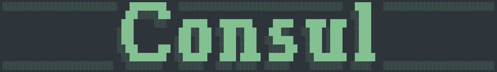

# Consul 🧑‍🔬

Consul is a set of simple CLI-based LLM Tools and Agents, primarily designed to assist with Python code development and automation tasks. The project is built on top of the `langgraph` framework and is distributed under the MIT license.



## Features

- **CLI Interface**: Interact with Consul via a command-line interface for maximum flexibility.
- **LLM Flows and Agents**: Modular flows for chat, documentation, and code testing, powered by large language models.
- **Extensible Tooling**: Easily add new tools (file operations, code analysis, etc.) for agent use.
- **Configurable**: YAML-based configuration for flows, prompts, and tools.
- **Project-Aware**: Can analyze and document Python projects, including class/function discovery and code relationships.

## Installation

### Environment Variables

Copy `.env.example` to `.env` and fill in the required values for your environment (e.g., Azure/OpenAI credentials).

### Local Installation

```bash
uv sync --all-extras --frozen
```

Run the CLI locally with:

```bash
uv run consul
```

### Global Installation

From the project root, install globally with:

```bash
pip install -e .
```
Or, to install in a separate venv:

```bash
pipx install -e .
```

Then invoke the CLI with:

```bash
consul
```

## Usage

Start Consul and select a flow:

```bash
consul --flow chat
```

Available flows include:
- `chat`: Ask LLM questions interactively.
- `docs`: Generate documentation for your codebase.
- `tester`: Run code testing flows.

During runtime, you can use various commands (see CLI help or code for details).

## Project Structure

- `src/consul/cli/`: CLI entrypoint, logging, and utilities.
- `src/consul/flows/`: Core flows and agent/task definitions.
- `src/consul/core/`: Configuration, settings, and environment management.
- `src/consul/prompts/`: Prompt templates and project-aware prompt logic.
- `src/consul/tools/`: Tool implementations (file operations, code analysis, etc.).
- `configs/`: YAML configuration files for flows and tools.
- `docs/`: Generated documentation.

## Main Components

- **BaseFlow**: Abstract base for all flows (tasks/agents).
- **ChatTask**: Simple LLM chat flow.
- **ReactAgentFlow**: Agent flow with tool support (ReAct pattern).
- **Tools**: File operations, code pattern search, and more.
- **CLI**: Main interface for user interaction.

## Example: Adding a New Tool

1. Implement your tool in `src/consul/tools/`.
2. Register it in `src/consul/core/config/tools.py`.
3. Add to the desired flow's config in `configs/`.

## Extending Flows

- Subclass `BaseFlow` or `ReactAgentFlow` in `src/consul/flows/`.
- Define your input/output schemas and graph logic.
- Register your flow in the CLI and config.

## License

MIT

---

This documentation was generated by AI flow "docs" from Consul (https://github.com/ofinke/consul) using LLM model gpt-4.
