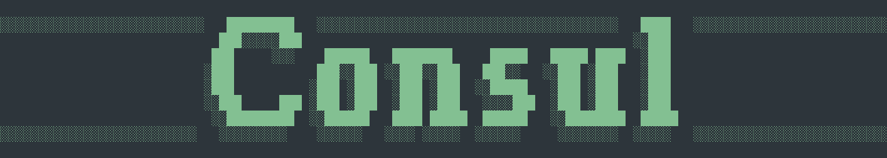

# Consul 🧑‍🔬

Consul 🧑‍🔬 is a terminal-based tool featuring a variety of LLM agents and workflows designed to assist with daily coding or other tasks.

## Features
                                                                                                          
- **Chat Flow:** Natural language chat interface for general queries and assistance.                                   
- **Coder Flow:** Design new features, analyze and document codebases, and generate documentation.                     
- **Tester Flow:** Create comprehensive tests and interactively evaluate their functionality.                          


## Quick start

### Environment Variables

Copy `.env.example` to `.env` and fill in the required values or export the variables into your terminal.

### Local Installation

```bash
uv sync --all-extras --frozen
```

Run the CLI locally with:

```bash
uv run consul
```

### Global Installation

From the project root, install globally with:

```bash
pip install -e .
```

Then invoke the CLI with:

```bash
consul
```
Installation using pipx doesn't work for now [TBD].

## Usage

Start Consul with default flow (chat):

```bash
consul
```

or with different flow

```bash
consul -f coder
consul -f tester 
```
**Available Flows**                                                                                                    
 | Flow    | Description                                                        |                                       
 |---------|--------------------------------------------------------------------|                                       
 | chat    | Basic chat interface for general queries                           |                                       
 | coder   | Feature design, codebase analysis, and documentation generation    |                                       
 | tester  | Interactive test creation and evaluation                           |

## How it works

- Consul is built around the concept of modular "flows," each representing a specific workflow (e.g., chat, coder, tester).
- Each flow is defined by a configuration file (in configs/) and implemented as a Python class (in src/consul/flows/). 
- All flows inherit from a common BaseFlow class, which provides a standard interface for input validation, state management, and execution.
- Flows use a graph-based execution model (via LangGraph), where each node represents a step (e.g., LLM call, tool invocation) and edges define the flow of data and decisions.
- The agent-based flows (like ReactAgentFlow) can dynamically select and invoke tools based on LLM output, enabling complex reasoning and code manipulation.
- State is passed and updated through the graph, allowing for multi-step reasoning, tool use, and iterative refinement.
- The CLI selects and runs a flow based on user input (e.g., consul -f coder), passing user queries and context into the flow’s input schema.
- Prompts, tools, and other behaviors are fully configurable, making it easy to extend or customize flows for new tasks.

## Contribution

- Create a feature branch from dev and PR back into it.
- Or create an issue

## License

MIT

---

This documentation was generated by AI flow "docs" from Consul (https://github.com/ofinke/consul) using LLM model gpt-4.
